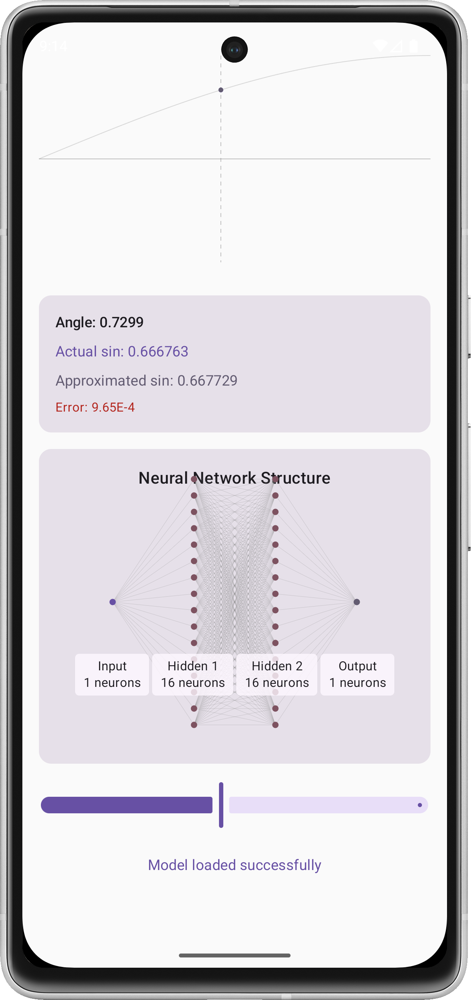
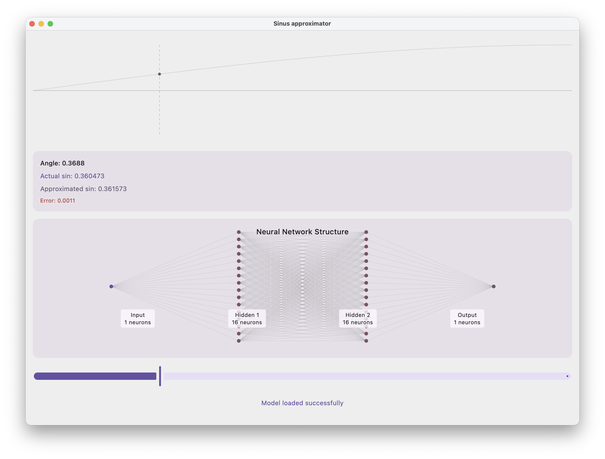
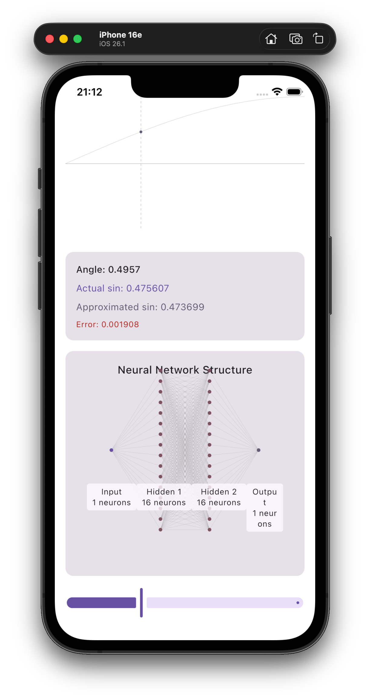
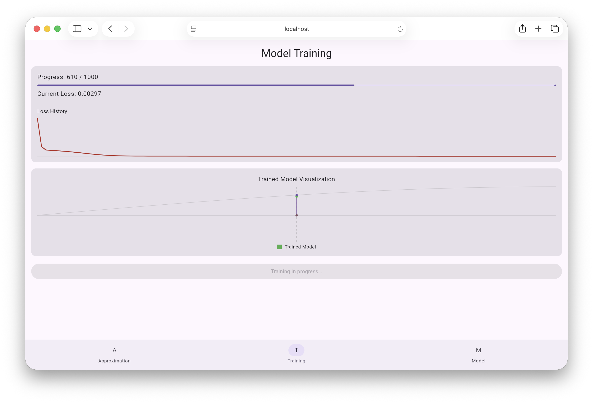

# Sinus Approximator (Kotlin Multiplatform Sample)

This project demonstrates a small Kotlin Multiplatform (KMP) app that approximates the sine function with a tiny neural network and visualizes it with Compose Multiplatform UI. The same codebase runs on Android, iOS, WebAssembly (Wasm), Desktop, and can be extended to Server. It also showcases capabilities of the SKaiNET ML framework.

What you can do in the app:
- Adjust sliders to change input value(angle) and see the result of the approximation in real time.
- Visualize the target sine curve and the model’s predicted curve.
- Visualization of Neural network architecture

## Screenshots

| Platform | Screenshot                                                                      |
| --- |---------------------------------------------------------------------------------|
| Android |  |
| JVM Desktop |                              |
| iOS |          |
| WebAssembly (Wasm / Browser) |                                    |

## Project layout
- `/composeApp` — shared UI and platform code for Compose Multiplatform.
  - `commonMain` — code common to all targets (UI, view models, etc.).
  - `androidMain`, `iosMain`, `desktopMain`, `wasmJsMain` — platform-specific glue.
- `/iosApp` — iOS application host (entry point and Xcode project).
- `/shared` — platform-agnostic logic shared across all targets (e.g., ML/Sinus calculator).

## How to run
- Desktop (Compose for Desktop): run the `run` configuration under `composeApp/src/desktopMain` or Gradle task `:composeApp:run`.
- Android: open the project in Android Studio and run the `androidApp` target/device.
- iOS: open `iosApp/iosApp.xcodeproj` in Xcode and run on a simulator or device.
- WebAssembly (browser): `:composeApp:wasmJsBrowserDevelopmentRun` Gradle task. WebAsemmbly target is also dockerized.

### Wasm in Docker

Running localy on port `8080`

```shell
docker build -t skainet/sinus .
docker run -p 8080:80 skainet/sinus
```
  
 

## Learn more
- SKaiNET framework: https://github.com/sk-ai-net/SKaiNET


If you face any issues, please report them here: https://github.com/sk-ai-net/skainet-samples/issues